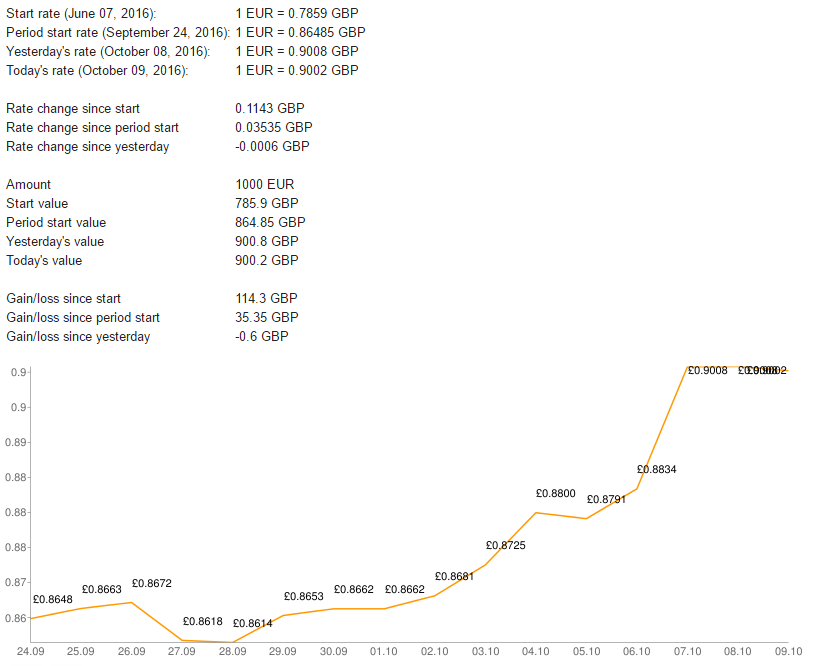

# currency-rate-monitor

Python app for monitoring currency rates and configured amount value changes.
Sends statistics and a graph with rate history to configured email. Fetches
rates from TransferWise.

# TransferWise API key

You need an [affiliate API key](https://api-docs.transferwise.com/v1/api-basics/authentication-and-headers#authentication-for-affiliates)
to get access to the TransferWise rates API that the script uses.

# Usage

1. Setup requirements and configuration:

        pip install --requirement=requirements.txt
        cp conf-example.py conf.py

2. Change configuration in `conf.py`
3. Launch the script:

        python currency-rate-monitor.py

4. Optionally add it to `cron`:

        sudo ln -s `pwd`/currency-rate-monitor.py /etc/cron.daily/currency-rate-monitor
        run-parts --test /etc/cron.daily

# Example

Here's how the email looks:

